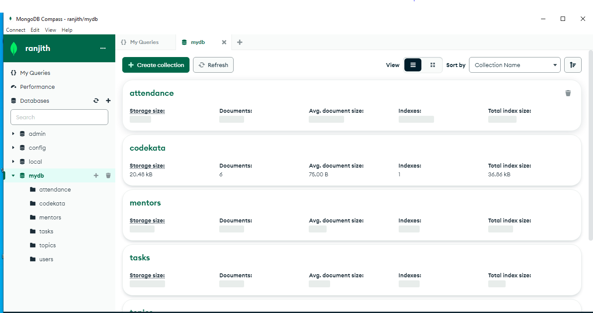

### MongoDB Task



##### 1) Find all the topics and tasks which are thought in the month of October

`db.topics.aggregate([
  
  {$lookup:{
    from:'tasks',
    localField:'topic_id',
    foreignField:'topic_id',
    as:'taskDetails'
  }},
  
  { $unwind: '$taskDetails' },
  {$project:{_id:0,topicName:1,date:1,Task_description:'$taskDetails.description',Task_status:'$taskDetails.status'}},
  {$match:{date:{$gt:new Date('2020-10-15'),$lt:new Date('2020-10-31')}}}    

 
  ]);`


##### 2)Find all the company drives which appeared between 15 oct-2020 and 31-oct-2020

`db.companyDrives.aggregate([
    {$match:{date:{$gt:new Date('2020-oct-15'),$lt:new Date('2020-oct-31')}}}    
]);
`

##### 3) Find all the company drives and students who are appeared for the placement.

`db.users.aggregate([
    {$lookup:{
        from:'companyDrives',
        localField:'userid',
        foreignField:'userid',
        as :'drives'
    }},
    {$unwind:'$drives'},
    {$project:{_id:0,userName:1,placementEligible:1,codecata:1,drive_name:'$drives.drive_name',status:'$drives.status'}},
    {$match:{placementEligible:"yes"}}
    
]);`


##### 4)Find the number of problems solved by the user in codekata

`db.users.aggregate([
    {$lookup:{
        from:'codekata',
        localField:'userid',
        foreignField:'userid',
        as :'C_kata'
    }},
    {$unwind:'$C_kata'},
    {$project:{_id:0,userName:1,solvedProblem:'$C_kata.solvedProblem'}}`

]);


##### 5)Find all the mentors with who has the mentee's count more than 15

`db.users.aggregate([

    
    {$group:{_id:'$mentorName',mentees_count:{$sum:1}}},
    {$match:{mentees_count:{$gt:15}}}
]);
`

##### 6)Find the number of users who are absent and task is not submitted  between 15 oct-2020 and 31-oct-2020

 ``` db.attendance.aggregate([
  
  {$lookup:{
    
    from:'topics',
    localField:'topic_id',
foreignField:'topic_id',
      as:'topics'
    
    
  }},

    {$lookup:{
      from:'tasks',
      localField:'topic_id', 
        foreignField:'topic_id',
        as:'tasks'
        

        
    }},

    {$unwind:'$topics'},
    {$unwind:'$topics'},
    {$project:{_id:0,attended:1,topicName:'$topics.topicName',date:'$topics.date',description:'$tasks.description',status:'$tasks.status'}},
    {$match:{attended:'false',status:'pending',$and:[{date:{$gt:new Date('2020-10-15'),$lt:new Date('2020-10-31')}}]}}   
  
  
  ]); 